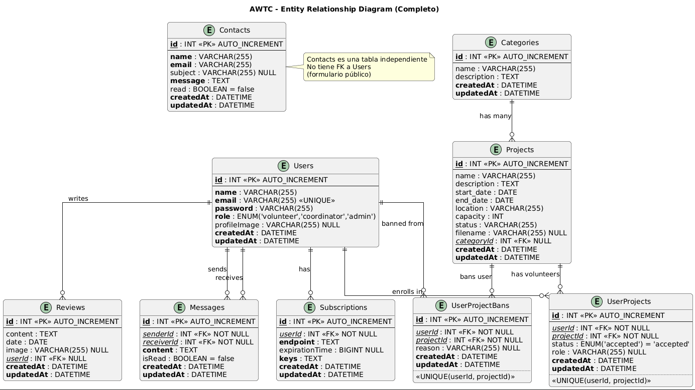
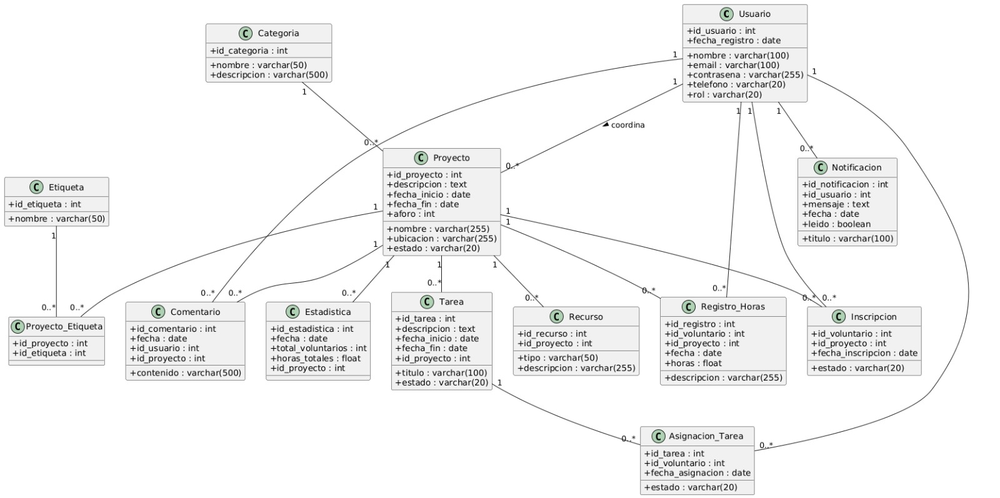
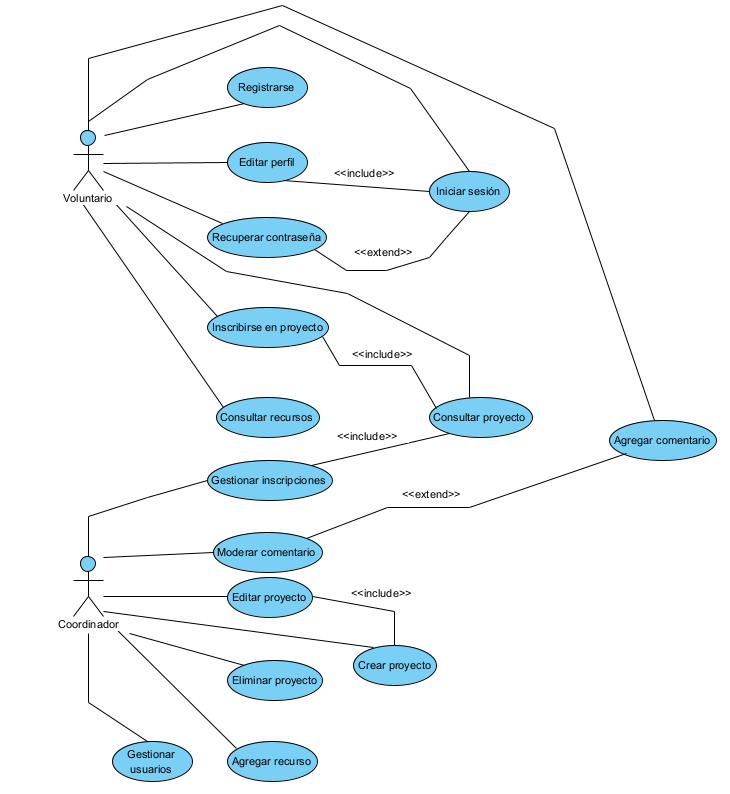

# AWTC - System Diagrams

This document contains the architectural and design diagrams of the AWTC project.

---

## 📊 Entity-Relationship Diagram (E/R)

The E/R diagram shows the database structure and relationships between tables.

### Main Tables:

- **Users**: System users (volunteers, coordinators, administrators)
- **Projects**: Volunteer projects
- **Categories**: Project categories
- **Reviews**: User-written reviews
- **Contacts**: Contact form messages
- **Messages**: Private messages between users
- **Subscriptions**: Push notification subscriptions
- **UserProjects**: Join table for user enrollments in projects
- **UserProjectBans**: Join table for user bans from projects

### Main Relationships:

| Relationship | Type | Description |
|--------------|------|-------------|
| Users → Reviews | 1:N | A user writes many reviews |
| Users → Messages (sender) | 1:N | A user sends many messages |
| Users → Messages (receiver) | 1:N | A user receives many messages |
| Users → Subscriptions | 1:N | A user has many push subscriptions |
| Users ↔ Projects | N:M | Users enroll in projects (via UserProjects) |
| Users ↔ Projects | N:M | Users can be banned from projects (via UserProjectBans) |
| Categories → Projects | 1:N | A category contains many projects |
| Contacts | Independent | No relationships (public form) |

---

## 🏗️ Class Diagram

The class diagram shows the structure of models, controllers, and services in the system.

### Main Packages:

#### Models
Contains domain classes representing database entities with their attributes and relationships.

#### Controllers
Handle HTTP requests and business logic:
- **UserController**: User management
- **ProjectController**: Project management
- **CategoryController**: Category management
- **ReviewsController**: Review management
- **ContactController**: Contact management
- **SessionController**: Authentication and sessions

#### Middlewares
Security and validation components:
- **AuthMiddleware**: JWT token verification
- **RequireAuth**: Session verification
- **RoleMiddleware**: Role-based access control

#### Services
Auxiliary services:
- **SocketIO**: Real-time communication
- **LDAPUtil**: OpenLDAP authentication
- **Multer**: File upload handling
- **WebPushService**: Push notifications

---

## 👥 Use Case Diagram

The use case diagram shows system functionalities organized by user type.

### Actors:

#### 🔵 Visitor
Unauthenticated user who can:
- View home page
- View project list
- View project details
- Register
- Login
- View About Us page
- Submit contact form
- View reviews in real-time
- Change language (ES/EN/FR)

#### 🟢 Volunteer
Authenticated user (inherits from Visitor) who can:
- Edit profile
- Upload profile image
- Enroll in projects
- Unregister from projects
- Write reviews with images
- View their projects
- Send and receive private messages
- Subscribe to push notifications
- Logout

#### 🟠 Coordinator
User with management permissions (inherits from Volunteer) who can:
- Create, edit, and delete projects
- Upload project images
- View project volunteers
- Ban and unban volunteers from projects
- Create, edit, and delete categories
- Delete reviews

#### 🔴 Administrator
User with full access (inherits from Coordinator) who can:
- Access administrative Dashboard
- View all users
- Create users manually
- Change user roles
- Delete users
- View contact messages
- Delete contact messages
- View user projects (with pagination)
- Complete system management
- View statistics and analytics

---

## 🔗 Links

- [Main README](../README.md)
- [Deployment Documentation](./deploy-sprint-4.md)
- [HTTPS Configuration](./https-configuration.md)
