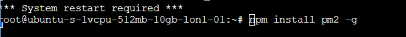
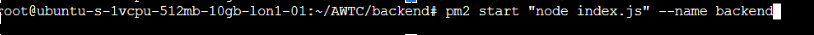
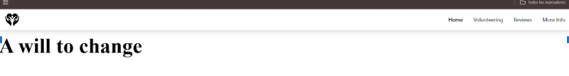

# 🚀 Deployment Guide on DigitalOcean

This guide explains how to deploy a project using **DigitalOcean Droplets**.
It includes droplet creation, server configuration, dependency installation, and application deployment.

---

## 📌 1. Creating the Droplet

1. Log in to **DigitalOcean**.
2. Go to **Droplets → Create Droplet**.
3. Select:
   - A **Region** for your server.
   - The **Operating System / environment** (e.g., Ubuntu).
   - A **Plan** (student accounts receive $200 in credits).
4. Finalize the configuration and create the **Droplet**.


---

## 📌 2. Droplet Configuration

### 🔹 Access the Droplet
You can access your droplet using:

- The **DigitalOcean Console**

- Install Node.js, npm and PM2
```bash
apt update & upgrade -y
apt install git nodejs
apt install npm
npm install pm2 -g
```



- Clone your repository
```bash
git clone <YOUR_REPOSITORY_URL>
cd <PROJECT_FOLDER>
npm install
```




- Viewing the Deployment



